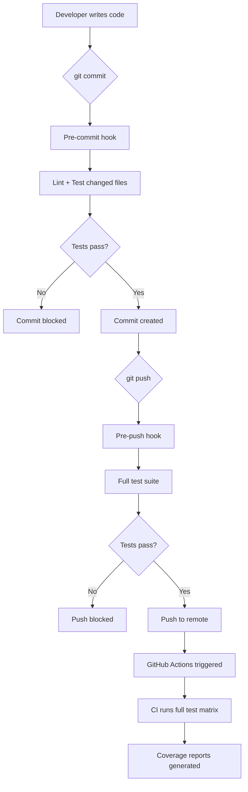

# Testing Automation Guide

## When Tests Run

### 1. **Pre-Commit Hook** (Local Development)
**When**: Before every `git commit`
**What runs**:
- Linting (ESLint + Prettier) via lint-staged
- Unit tests for changed packages only
- Full test suite if critical files (wallet, shuffle, auth) are modified
**Purpose**: Catch issues before they enter the repository

### 2. **Pre-Push Hook** (Local Development)
**When**: Before every `git push`
**What runs**:
- Full test suite with coverage (`npm run test:ci`)
- TypeScript type checking
**Purpose**: Ensure all tests pass before code reaches remote

### 3. **GitHub Actions CI** (Automated)
**When**: 
- On every push to `main` or `develop` branches
- On every pull request to `main` or `develop`
- Manual trigger via GitHub Actions UI
**What runs**:
- Linting
- Type checking
- Full test suite on Node.js 18.x and 20.x
- Coverage reporting to Codecov
- Package-specific coverage threshold checks
**Purpose**: Ensure code quality across different environments

### 4. **Manual Execution** (On Demand)
**When**: Developer chooses to run
**Commands**:
```bash
# Run all tests
npm test

# Run with coverage
npm run test:ci

# Run specific package tests
npm test -w @primo-poker/security
npm test -w @primo-poker/persistence

# Run specific test file
npm test -- secure-shuffle.test.ts

# Run tests in watch mode
npm test -- --watch
```

## Test Execution Flow



## Configuration Files

### `.github/workflows/test.yml`
- Defines CI/CD pipeline
- Runs on push/PR to main/develop
- Tests on multiple Node versions
- Uploads coverage reports

### `.husky/pre-commit`
- Runs lint-staged
- Tests changed packages
- Full tests for critical files

### `.husky/pre-push`
- Runs complete test suite
- Type checking
- Blocks push if tests fail

### `jest.config.js` (in each package)
- Test configuration
- Coverage thresholds (80% for all metrics)
- Module resolution settings

## Best Practices

1. **Always run tests locally** before pushing
   ```bash
   npm test
   ```

2. **Check coverage** for new code
   ```bash
   npm test -- --coverage
   ```

3. **Run specific tests** during development
   ```bash
   npm test -- --watch secure-shuffle
   ```

4. **Fix failing tests immediately** - don't disable or skip

5. **Update tests** when changing functionality

## Troubleshooting

### Tests not running on commit?
```bash
# Reinstall husky hooks
npm run prepare
```

### Tests failing in CI but passing locally?
- Check Node.js version matches CI (18.x or 20.x)
- Ensure all dependencies are in package.json
- Check for timing-dependent tests

### Coverage below threshold?
```bash
# See detailed coverage report
npm test -- --coverage --coverageReporters=html
# Open coverage/index.html in browser
```

## Coverage Requirements

All packages must maintain:
- **Branches**: 80%
- **Functions**: 80%
- **Lines**: 80%
- **Statements**: 80%

Critical components (security, wallet) should aim for >90%.